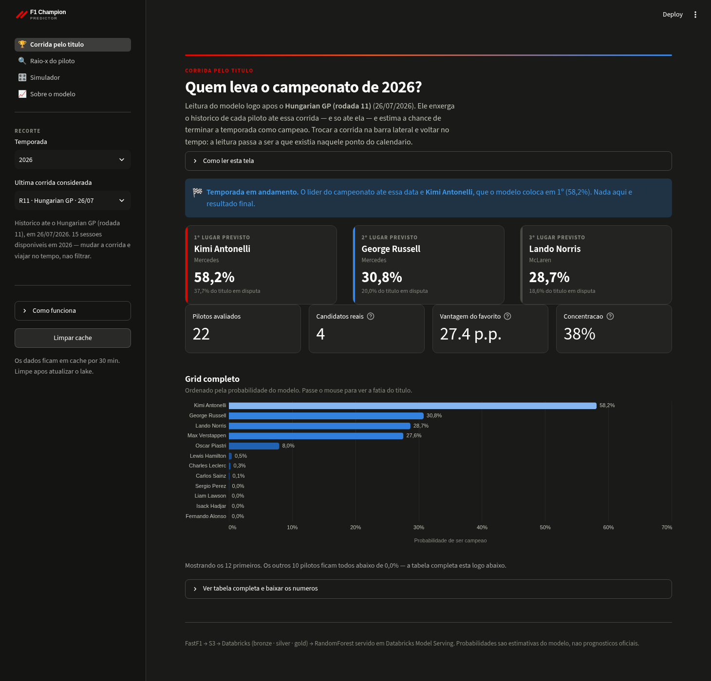
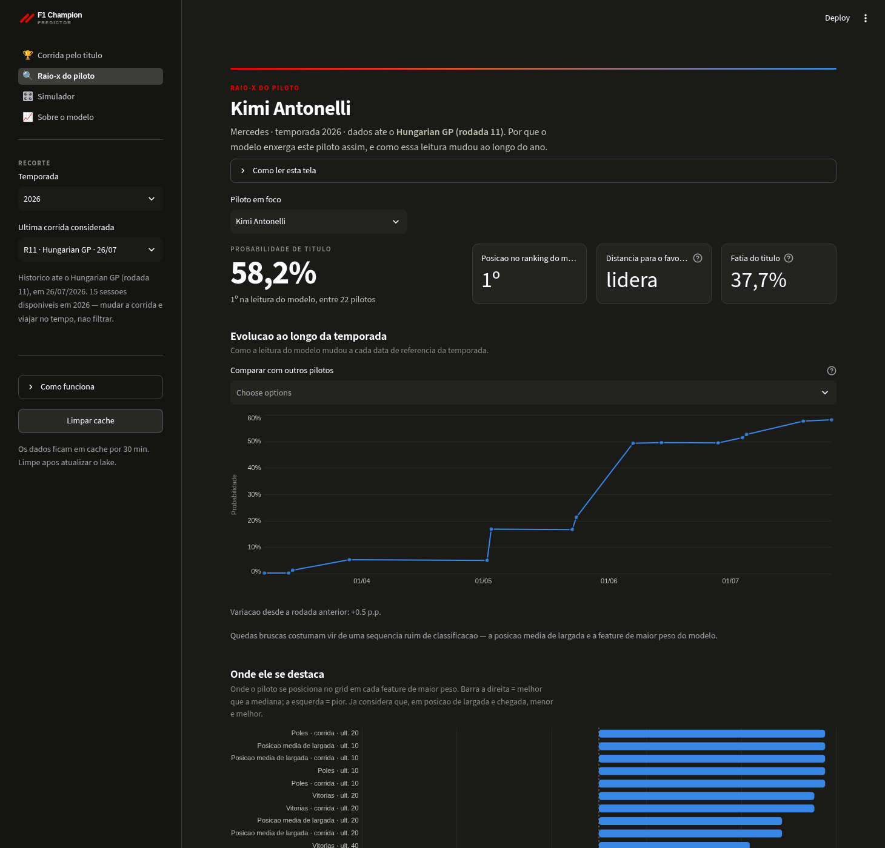
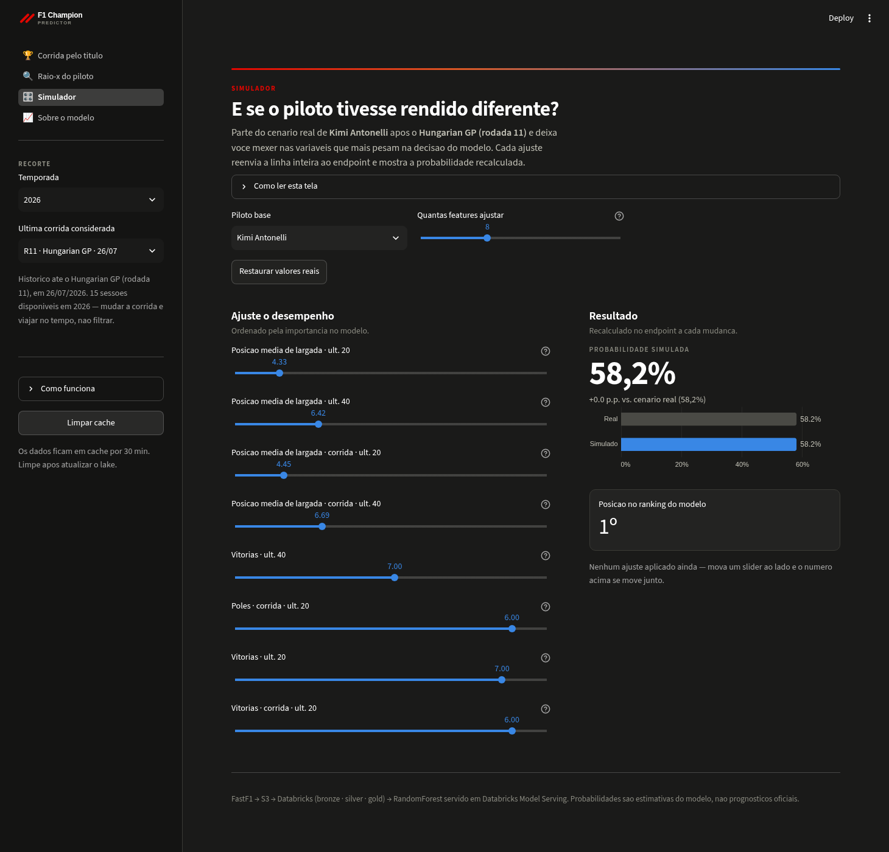
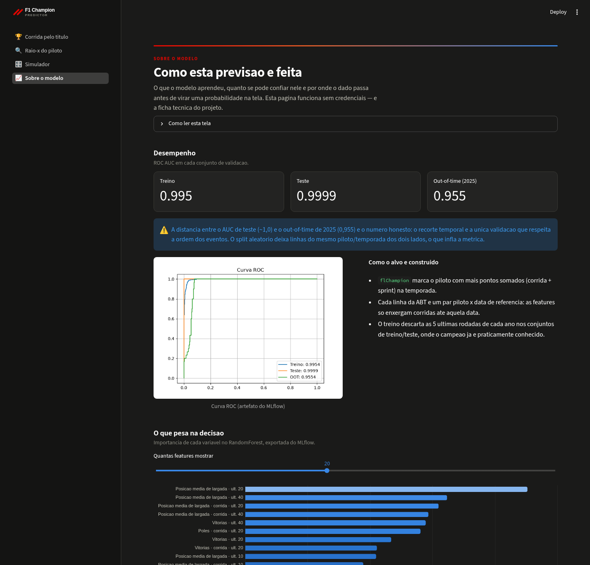

# 🏎️ F1 Lake — Pipeline de Dados e ML para Previsão de Campeões de F1

**▶️ App no ar: [f1championsmodel.streamlit.app](https://f1championsmodel.streamlit.app)**

Pipeline de dados end-to-end que coleta dados históricos de Fórmula 1, os organiza em uma arquitetura de Data Lakehouse (camadas Bronze/Silver/Gold) e treina um modelo de Machine Learning para prever se um piloto será campeão da temporada, com base em seu histórico recente de performance.

O projeto cobre o ciclo completo de um caso de uso de dados: **ingestão → armazenamento → transformação → feature engineering → modelagem → serving**.

> **Nota sobre o repositório**: apenas a etapa de **coleta e envio de dados** (`main.py`, `collect.py`, `sender.py`) é de fato executada localmente/neste código. As pastas `etl/` e `ml_champion/` são a **representação em código** das queries e notebooks que rodam no **Databricks** — ou seja, os arquivos `.sql` e os scripts de transformação/treino documentam a lógica que foi executada diretamente no workspace do Databricks (Spark Declarative Pipelines, Unity Catalog, MLflow gerenciado), e não um pipeline local end-to-end.

---

## 🎯 Problema de negócio

Dado o histórico de resultados de um piloto de F1 (posições de largada, pódios, poles, ultrapassagens, pontos, etc.), qual a probabilidade dele ser campeão da temporada atual? O modelo final expõe essa probabilidade via uma API própria, podendo ser consumida por dashboards ou outras aplicações.

---

## 🏗️ Arquitetura

O projeto segue uma **arquitetura medalhão (medallion architecture)**, com duas frentes de execução distintas:

- 🖥️ **Local** (este repositório, executado via `python main.py`): extração dos dados da API de F1 e envio para o Data Lake na AWS.
- ☁️ **Databricks** (queries e notebooks — representados aqui em `.sql`/`.py`, mas rodados no workspace): todas as transformações (Bronze → Silver → Gold) e todo o ciclo de Machine Learning (treino, tracking e serving).

`main.py` (raiz) orquestra o processo de coleta e envio **em loop contínuo**, rodando o ciclo a cada 6 horas — a única parte do pipeline pensada para rodar continuamente fora do Databricks.

---

## 🧩 Camadas do pipeline

### 1. Ingestão e carga (execução local — `main.py`)

- **`collect.py`**: usa a biblioteca [FastF1](https://github.com/theOehrly/Fast-F1) para extrair resultados de corridas (Race e Sprint) de múltiplas temporadas (2020–2026), enriquecendo cada registro com metadados do evento (país, local, rodada, data). Os dados são salvos localmente em **Parquet**, formato colunar mais eficiente que CSV para pipelines analíticos.
- **`sender.py`**: envia os arquivos Parquet gerados para um bucket **AWS S3** via `boto3` — a camada *raw/bronze* do lakehouse — e remove os arquivos locais após o upload confirmado.
- **`main.py`**: laço que executa coleta + envio a cada 6 horas, mantendo o lake atualizado incrementalmente com novas corridas.

Essa é a única parte do repositório pensada para ser executada como está, fora de um ambiente Databricks.

### 2. Transformação — Bronze → Silver → Gold (código representando execução no Databricks)

A partir daqui, os arquivos em `etl/` **documentam** a lógica rodada em notebooks/queries do workspace Databricks, usando **PySpark**, **Spark Declarative Pipelines** e **Unity Catalog** para versionamento e governança de tabelas:

- **`etl/fs_driver.sql`** / **`etl/fs_f1_drivers_all.sql`**: constroem uma *Feature Store* de pilotos — para cada data de referência, calculam estatísticas de performance (pódios, poles, ultrapassagens, posição média de largada e chegada) considerando diferentes janelas históricas (últimas 10, 20, 40 corridas e carreira completa).
- **`etl/main.py`**: mesma lógica reescrita com a API declarativa do PySpark (`@dp.materialized_view`), formato usado para rodar como pipeline gerenciado no Databricks.
- **`etl/f1_champion.sql`**: identifica o campeão de cada temporada via `ROW_NUMBER()` sobre a soma de pontos por piloto/ano.
- **`etl/abt_f1_drivers_champion.sql`**: monta a **ABT (Analytical Base Table)** final na camada Gold (`lakehouse.gold.abt_f1_drivers_champion`), unindo a feature store com a flag de campeão (`flChampion`) — a tabela usada diretamente pelo modelo de ML.

### 3. Machine Learning (código representando execução no Databricks)

Pasta **`ml_champion/`** — também roda no workspace Databricks, aproveitando o MLflow gerenciado nativamente pela plataforma:

- **`train.py`**: pipeline de treino com `scikit-learn`, seguindo a metodologia **SEMMA**:
  - Amostragem estratificada (treino/teste) e separação de um período *out-of-time* (2025) para validar a robustez temporal do modelo
  - Tratamento de valores ausentes com `feature-engine` (`ArbitraryNumberImputer`)
  - Modelo: `RandomForestClassifier`
  - Rastreamento completo do experimento com **MLflow**: métricas de ROC AUC, curva ROC, importância de features e o modelo versionado no Model Registry
- **`app.py`**: API de *model serving* com **Flask**, que carrega a versão mais recente do modelo registrada no MLflow e expõe:
  - `GET /health_check`
  - `POST /predict` — recebe features de um ou mais pilotos e retorna a probabilidade de título
- **`feature_importances.md`** / **`roc_curve.png`**: artefatos de avaliação do modelo, exportados do experimento rodado no Databricks.

**Resultados do modelo** (registrados no MLflow tracking):

| Conjunto | ROC AUC |
|---|---|
| Treino | 0.995 |
| Teste | 0.9999 |
| Out-of-time (2025) | 0.955 |

As features mais relevantes são as relacionadas à **posição média de largada nas últimas 10–40 corridas** e à **quantidade de poles/vitórias recentes**, o que faz sentido no domínio: performance recente de qualificação é um forte preditor de título.

> Nota: a diferença entre AUC de teste (quase 1.0) e AUC out-of-time (0.955) sugere que o corte temporal *out-of-time* é a validação mais realista da capacidade de generalização do modelo — um ponto interessante para discutir em entrevista técnica sobre *data leakage* e validação temporal em séries históricas.

---

## 🛠️ Stack de tecnologias

| Categoria | Ferramenta | Uso no projeto | Onde roda |
|---|---|---|---|
| Linguagem | **Python 3.12** | Toda a lógica de extração, orquestração e ML | Local + Databricks |
| Coleta de dados | **FastF1** | API não-oficial de telemetria e resultados de F1 | Local |
| Processamento de dados | **Pandas**, **PyArrow (Parquet)** | Manipulação e armazenamento colunar eficiente | Local |
| Cloud / Storage | **AWS S3 (boto3)** | Camada de armazenamento bruto do Data Lake | Local → S3 |
| Big Data / Lakehouse | **PySpark**, **Spark Declarative Pipelines**, **Unity Catalog** | Transformações declarativas e governança em arquitetura medalhão | Databricks |
| Orquestração de lakehouse | **Nekt SDK** | Leitura/gestão de tabelas do lakehouse | Databricks / local (export) |
| Machine Learning | **scikit-learn** (RandomForest), **feature-engine** | Modelagem preditiva e tratamento de dados faltantes | Databricks |
| MLOps | **MLflow** (tracking + model registry) | Rastreabilidade de experimentos e versionamento de modelos | Databricks (gerenciado) |
| Serving | **Flask**, **Databricks Model Serving** | API REST para consumo do modelo em produção | Databricks / local |
| Interface | **Streamlit**, **Altair** | Plataforma de consumo do modelo (ranking, raio-x, simulador) | Streamlit Community Cloud |
| Ambiente / DevOps | **Dev Containers (Docker)**, **python-dotenv** | Ambiente de desenvolvimento reprodutível com Java + Spark | Local |

---

## 📁 Estrutura do repositório

```
f1-lake/
├── collect.py              # [LOCAL] Extração dos dados via FastF1
├── sender.py                # [LOCAL] Upload dos arquivos para S3
├── main.py                  # [LOCAL] Orquestração do loop de coleta + envio
├── etl/                      # [DATABRICKS] Representação das queries/notebooks
│   ├── fs_driver.sql              # Feature store (SQL puro)
│   ├── fs_f1_drivers_all.sql      # Feature store completa (múltiplas janelas)
│   ├── f1_champion.sql            # Identificação do campeão da temporada
│   ├── abt_f1_drivers_champion.sql# ABT final (camada Gold)
│   ├── main.py                    # Pipeline declarativo em PySpark
├── ml_champion/               # [DATABRICKS] Representação do notebook de ML
│   ├── train.py               # Treino do modelo + tracking MLflow
│   ├── app.py                  # API Flask de serving do modelo
│   ├── predict.py              # Script de teste da API
│   ├── feature_importances.md  # Importância das variáveis
│   └── roc_curve.png           # Curva ROC do modelo
├── streamlit_app.py           # [APP] Entrypoint da plataforma Streamlit
├── f1_app/                    # [APP] Modulos da interface (dados, scoring, graficos, telas)
├── .env.example               # [APP] Modelo do .env com as credenciais do Databricks
├── scripts/probe_endpoint.py  # [APP] Diagnostico do endpoint de serving
├── .devcontainer/             # Ambiente de desenvolvimento local (Docker + Spark + Jupyter)
└── data/                      # Dados intermediários (parquet/csv) da etapa local
```

---

## ▶️ Como executar

### Etapa local (coleta e envio)

1. Clone o repositório e abra em um **Dev Container** (recomendado — já inclui Java, Spark e Jupyter configurados) ou instale as dependências manualmente.
2. Configure as variáveis de ambiente em um arquivo `.env`:
   ```
   AWS_KEY=...
   AWS_SECRET_KEY=...
   BUCKET_NAME=...
   ```
3. Rode a coleta e o envio contínuo dos dados:
   ```bash
   python main.py
   ```

### Etapa Databricks (transformação e ML)

Os arquivos em `etl/` e `ml_champion/` foram desenhados para rodar no workspace Databricks:

4. Publique as queries de `etl/*.sql` (ou o pipeline declarativo `etl/main.py`) como uma **Lakeflow Pipeline**, apontando `f1_results` (camada Bronze, alimentada a partir do S3) como fonte.
5. Rode `ml_champion/train.py` em um notebook Databricks — o MLflow tracking é gerenciado automaticamente pelo workspace.
6. `ml_champion/app.py` pode ser servido tanto localmente quanto via Databricks Model Serving, carregando o modelo do Model Registry.

---

## 🖥️ Plataforma de consumo (Streamlit)

🔗 **[f1championsmodel.streamlit.app](https://f1championsmodel.streamlit.app)**

O modelo servido no Databricks é consumido por um app **Streamlit** (`streamlit_app.py`), que fecha o
ciclo do projeto: em vez de um `curl` no endpoint, o usuário navega pela temporada e vê a leitura do
modelo rodada a rodada.

Como o modelo recebe **172 features**, o app nunca pede que o usuário as digite: ele lê a linha do
piloto direto da ABT da camada Gold via **SQL Warehouse** e envia essa linha ao endpoint de serving.
Cada tela abre com um resumo do que ela responde e um bloco *"Como ler esta tela"*, para que alguém
que nunca viu o projeto consiga navegar sozinho.



### Decisões de interface

- **Controle perto do que ele muda.** O que vale para o app inteiro (temporada e corrida) fica na
  barra lateral; o que muda o assunto daquela tela (piloto em foco, cenário do simulador) fica na
  própria página, logo abaixo do cabeçalho. O título continua sendo o nome do piloto porque o
  cabeçalho é renderizado num container reservado antes da leitura do seletor.
- **Escolhe-se a corrida, não a data.** O seletor mostra `R11 · Hungarian GP · 26/07` em vez de uma
  data solta — cada data de referência da ABT corresponde a uma sessão do calendário. O rótulo tem
  duas formas: uma para varrer a lista e outra para caber no meio de uma frase.
- **Pódio antes do gráfico.** A pergunta "quem ganha?" é respondida nos três primeiros cartões; o
  grid completo vem depois, para quem quer o detalhe.
- **Cauda cortada.** O gráfico mostra os 12 primeiros — numa temporada típica, dez pilotos ficam em
  0,0% e viram ruído. A tabela completa continua a um clique.
- **Probabilidade x fatia do título.** As probabilidades são estimativas independentes por piloto e
  não somam 100%; a *fatia* normaliza para somar. As duas aparecem lado a lado, porque respondem a
  perguntas diferentes.
- **Percentil, não diferença relativa.** No raio-x, a comparação com o grid usa percentil: em
  contadores cuja mediana é zero (vitórias, poles), qualquer razão contra zero satura em +100% e
  todas as barras ficam iguais.
- **Temporada em curso é sinalizada.** Para o ano corrente, `flChampion` marca o líder de pontos, não
  um campeão — a tela avisa em vez de anunciar um título que ainda não existe.
- **Paleta validada.** As cores dos gráficos passaram por checagem de daltonismo e contraste sobre a
  superfície escura; o vermelho da F1 aparece só na identidade (barra de marca, pódio), nunca
  codificando valor.

### Telas

| Tela | O que mostra |
|---|---|
| **Corrida pelo título** | Ranking de probabilidade de todos os pilotos na data de referência escolhida, fatia normalizada do título, pontos acumulados e conferência contra o campeão real (para a temporada em curso, mostra o líder de pontos e avisa que nada é resultado final) |
| **Raio-x do piloto** | Probabilidade do piloto, variação em relação à rodada anterior, curva de evolução ao longo da temporada (com até 2 pilotos de comparação) e diferença dele para a mediana do grid nas features de maior peso |
| **Simulador** | Sliders sobre as features mais importantes a partir do cenário real do piloto; cada ajuste reenvia a linha ao endpoint e mostra a nova probabilidade e a nova posição no ranking |
| **Sobre o modelo** | ROC AUC (treino/teste/out-of-time), curva ROC, importância das variáveis e o mapa das camadas do pipeline |

<table>
  <tr>
    <td width="50%"><br><sub>Raio-x do piloto</sub></td>
    <td width="50%"><br><sub>Simulador</sub></td>
  </tr>
  <tr>
    <td colspan="2"><br><sub>Sobre o modelo</sub></td>
  </tr>
</table>

### Como rodar localmente

```bash
pip install -r requirements.txt
cp .env.example .env          # preencha os dois valores obrigatórios
streamlit run streamlit_app.py
```

O `.env` (já ignorado pelo git) precisa de duas variáveis:

```dotenv
DATABRICKS_TOKEN=dapi...                             # PAT com CAN QUERY no serving endpoint
DATABRICKS_HTTP_PATH=/sql/1.0/warehouses/xxxxxxxxxx  # SQL Warehouse > Connection details
```

| Variável | Onde pegar no Databricks |
|---|---|
| `DATABRICKS_TOKEN` | Ícone do usuário → **Settings → Developer → Access tokens → Generate new token** |
| `DATABRICKS_HTTP_PATH` | **SQL → SQL Warehouses →** (seu warehouse) **→ Connection details →** campo *HTTP path* |

`SERVING_ENDPOINT_URL`, `DATABRICKS_HOST`, `ABT_TABLE` e `RESULTS_TABLE` já têm default no código e só
precisam ser definidos se mudarem de workspace, endpoint ou nome de tabela.

### Publicação (Streamlit Community Cloud)

O app está publicado em **[f1championsmodel.streamlit.app](https://f1championsmodel.streamlit.app)**.

Para republicar a partir de um fork: aponte o app para `streamlit_app.py` (o `requirements.txt` da
raiz é instalado automaticamente) e configure os segredos. O `.env` **não** sobe para o repositório —
no painel do app, vá em **Settings → Secrets** e cole os mesmos valores em formato TOML (a leitura de
`st.secrets` tem prioridade sobre o ambiente):

```toml
DATABRICKS_TOKEN = "dapi..."
DATABRICKS_HTTP_PATH = "/sql/1.0/warehouses/xxxxxxxxxx"
```

O SQL Warehouse serverless hiberna quando ocioso: a primeira consulta depois de um período parado
leva ~25s para acordar. As respostas ficam em cache por 30 min.

### Diagnóstico de credenciais

```bash
python scripts/check_auth.py     # não imprime o token; mostra tipo, escopos e o que ele alcança
```

| Erro | Causa | Correção |
|---|---|---|
| `access token does not have required scopes: sql` | O token é OAuth (JWT) sem o escopo `sql` — não é um PAT | Gere um PAT em **Settings → Developer → Access tokens** (começa com `dapi`) |
| `Invalid access token` / 401 | Token expirado ou inválido | Gere outro e atualize o `.env` |
| `Multiple Pages specified with URL pathname` | Duas `st.Page` com o mesmo `url_path` | Cada `st.Page` precisa de `url_path` explícito |
| Ranking todo em 0% ou 100% | Endpoint devolve classe, não probabilidade | Ver o aviso sobre `serve_proba.py` acima |

### Estrutura do app

```
streamlit_app.py             # entrypoint e navegação
f1_app/
├── config.py                # segredos e endpoints
├── data.py                  # queries no SQL Warehouse (com cache)
├── scoring.py               # cliente do endpoint de serving
├── charts.py                # gráficos Altair
├── theme.py                 # tema escuro, tokens de cor e componentes de layout
├── model_meta.py            # métricas e importâncias lidas dos artefatos
├── ui.py                    # componentes compartilhados (cabeçalho, barra lateral)
└── views/                   # uma tela por arquivo
assets/brand.svg             # marca exibida no topo da barra lateral
docs/screenshots/            # capturas usadas neste README
scripts/probe_endpoint.py    # diagnóstico do endpoint (formato de payload e tipo de saída)
scripts/check_auth.py        # diagnóstico do token (tipo, escopos, alcance)
```

> ⚠️ **Probabilidade vs. classe**: por padrão o flavor `mlflow.sklearn` serve `predict()`, que devolve
> a classe (0/1) — inútil para ranquear pilotos (foi o comportamento observado no endpoint em 01/09/2026:
> Verstappen e Norris em 100%, todo o resto em 0%). A correção é `pyfunc_predict_fn="predict_proba"` no
> `log_model` — já aplicado em `ml_champion/train.py`. Para corrigir o modelo **já registrado**, sem
> retreinar, rode `ml_champion/serve_proba.py` num notebook e aponte o endpoint para a nova versão.
> O app detecta o caso e avisa na tela em vez de exibir um ranking sem sentido.

---

## 💡 Principais aprendizados e destaques técnicos

- Separação clara entre a etapa **operacional/local** (ingestão contínua de dados) e a etapa **analítica/gerenciada** (transformação e ML no Databricks), refletindo como pipelines de dados reais costumam ser distribuídos entre diferentes ambientes de execução.
- Aplicação prática de **arquitetura medalhão** (Bronze/Silver/Gold) em um cenário real de dados esportivos.
- Uso de **Spark Declarative Pipelines** para transformações versionadas e parametrizáveis.
- Construção de uma **Feature Store temporal**: as features são recalculadas para cada data de referência histórica, evitando vazamento de dados (*data leakage*) ao simular o que era conhecido até aquele momento — técnica essencial para problemas de séries temporais.
- Validação de modelo com **holdout out-of-time**, mais rigorosa do que um split aleatório tradicional.
- Ciclo de vida de ML completo com **MLflow** (tracking, artefatos, model registry) e **serving via API própria**.

---